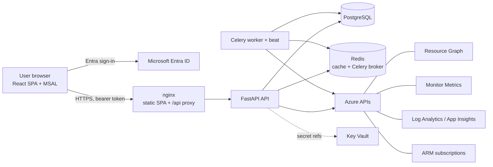

# Architecture

## Components



| Component | Technology | Responsibility |
| --- | --- | --- |
| Frontend | React, TypeScript, Vite, Tailwind CSS, Radix primitives, Recharts, TanStack Query, Axios, MSAL | UI. Holds no Azure credentials. Acquires an Entra access token for the API only |
| API | FastAPI, Pydantic, SQLAlchemy 2.x (async), Alembic | Authentication, authorisation, REST API under `/api/v1`, platform health endpoints |
| Worker | Celery (Redis broker) | Discovery and sync, health evaluation, alert evaluation |
| Beat | Celery beat | Schedules syncs (`SYNC_INTERVAL_MINUTES`) and health/alert evaluation (`HEALTH_INTERVAL_MINUTES`) |
| Database | PostgreSQL 16 (JSONB for tags, properties and widget configuration) | System of record |
| Cache | Redis, or an in-process TTL cache when `REDIS_URL` is unset | Metric series, Resource Health snapshots, overview feeds, rate-limit counters |

## Backend layering

```text
app/api/v1/*.py          Route handlers: validation, authorisation, orchestration. No Azure SDK calls.
app/services/*.py        Domain services: discovery, metric_service, health, alerts, comparison, kql_guard, audit
app/services/monitors/   Resource-type plugins (metrics, health rules, log queries, dashboard templates)
app/services/azure/      Azure access behind Protocols in types.py
   resource_graph.py     Resource Graph + ARM subscriptions (real)
   monitor.py            Azure Monitor Metrics (real)
   log_analytics.py      Resource-centric log queries (real)
   mock/                 Deterministic demo implementations of the same Protocols
   provider.py           Chooses real or mock from AZURE_PROVIDER
app/models/              SQLAlchemy models
app/core/                Config, security (token validation), permissions, errors, logging, cache, metrics
```

Route handlers depend on `AzureServices` (`resource_graph`, `metrics`, `logs`) through a FastAPI dependency. Tests replace it with `set_azure_services()`.

## Data model

All business tables carry `organization_id`, so the schema is ready for multiple organisations even though a typical deployment has one. Primary keys are UUIDs, timestamps are timezone-aware, and soft deletion (`deleted_at`) is used where history matters.

| Table | Purpose |
| --- | --- |
| `organizations` | Tenant boundary; mapped to an Entra tenant (`entra_tenant_id`) |
| `roles` | Role definitions, seeded by the initial migration. Permissions are enforced from `app/core/permissions.py` |
| `users` | Approved members and pending invitations. Identity key `(organization_id, entra_tenant_id, entra_object_id)`, unique when bound. `status` is `pending`, `active`, `suspended` or `deactivated`. See [user-access-management.md](user-access-management.md) |
| `projects`, `environments` | Project hierarchy, with `tag_values` used for resource mapping |
| `azure_connections` | Tenant plus sync settings. Metadata only, no credentials |
| `subscriptions`, `resource_groups`, `resources` | Discovered inventory. `resources.azure_id` (lower-cased ARM ID) is unique per organisation |
| `sync_runs` | Per-run status, step progress (`steps` JSON) and statistics |
| `dashboard_templates`, `dashboards`, `dashboard_widgets` | Template engine output |
| `health_thresholds` | Organisation overrides of plugin health rules |
| `alert_rules`, `alerts`, `alert_events` | Alerting |
| `notification_channels` | Delivery targets. `secret_ref` names a Key Vault secret |
| `audit_logs` | Administrative actions, sign-ins and denials |

The schema is managed only through Alembic (`backend/alembic/versions`). The initial migration was generated against PostgreSQL, and `alembic check` reports no drift.

## Key flows

### Signing in and access control

1. The SPA signs in with MSAL (redirect, PKCE) and sends the access token as a bearer token.
2. `get_principal` validates the token (`app/core/security.py`). This proves identity only.
3. `get_current_user` (`app/api/deps.py`) calls `resolve_member` (`app/services/authentication/users.py`). It looks up the user by `(organisation, tid, oid)`. If there is no match, it provisions the configured bootstrap Super Admin or activates a matching pending invitation. It refuses anyone who is not `active` with `403 ACCESS_NOT_GRANTED` or `ACCESS_SUSPENDED`.
4. `require(Permission.x)` checks the role's permissions.

All protected routes depend on step 3, which runs on every request. The SPA's `MeGate` renders nothing protected until `GET /auth/me` succeeds, and shows the access page on refusal. Administrator operations live in `app/services/user_management.py`. See [user-access-management.md](user-access-management.md).

### Connecting a subscription

```text
POST /api/v1/azure/connections
  -> validate input and permissions (azure:connect), reject already-connected subscriptions
  -> save connection + subscriptions, create sync_run (queued), audit, commit
  -> enqueue sync job (Celery, or inline in development)
Worker: execute_sync()
  1 authenticate      2 verify subscriptions (ARM get)   3 verify read permissions (Resource Graph)
  4 discover resources  5 categorise and assign          6 apply dashboard templates   7 evaluate health
UI polls GET /api/v1/azure/sync-runs/{id} and renders each step's status and detail.
```

If a step fails, the step is marked failed, the remaining steps are marked skipped, and the connection records the error code and message. A health-step failure does not fail the sync.

### Resource mapping

Tags are merged from the resource group and the resource, with resource tags taking precedence. The first matching key from `PROJECT_TAG_KEYS` and `ENVIRONMENT_TAG_KEYS` is compared, case-insensitively, against each project's slug, name and `tag_values`, and each environment's slug, name, `tag_values` and kind aliases (for example `prod`, `prd` and `live` for `production`). If the tags do not match, the connection's default project and environment are used. An assignment made manually through the API is never overwritten by sync.

### Rendering a dashboard

The UI loads `GET /dashboards/by-resource/{id}`. Each widget calls `GET /resources/{id}/metrics?metrics=<keys>` or `POST /logs/query` with a predefined `query_key`. The `MetricService` resolves plugin metric keys to Azure metric names, namespaces, aggregations, dimension splits and target resources, then applies caching and returns a provider-neutral structure:

```json
{"key": "plan_cpu", "label": "Plan CPU", "unit": "percent", "aggregation": "Average",
 "interval_seconds": 1800, "series": [{"name": "Plan CPU", "dimensions": {}, "points": [{"timestamp": "...", "value": 42.3}]}],
 "summary": {"avg": 41.2, "min": 12.0, "max": 88.1, "sum": 1977.6, "latest": 42.3},
 "source_resource_id": "...", "unavailable_reason": null, "is_mock": false}
```

A metric that cannot be read (for example missing permission, no data, or an undiscovered related resource) returns `unavailable_reason` and does not break the rest of the dashboard.

### Background jobs

| Job | Trigger | Entry point |
| --- | --- | --- |
| Sync one connection | Connect, "Sync now", scheduler | `app.services.discovery.run_sync_job` |
| Schedule syncs | Beat, every `SYNC_INTERVAL_MINUTES` | `app.services.scheduling.schedule_due_syncs` |
| Health and alert evaluation | Beat, every `HEALTH_INTERVAL_MINUTES` | `app.services.health.evaluator.run_health_job` |

Only one sync runs per connection at a time. A queued or running run older than one hour is treated as stale and marked failed.

## Frontend structure

```text
src/api        Axios client (token interceptor, structured error handling), endpoint functions
src/components UI primitives (components/ui), dashboard widgets (components/widgets), project and
               environment cards (components/projects), Breadcrumbs, HealthText/HealthSummary,
               FilterChips, Freshness, AlertsExplorer, EnvironmentResourceTable
src/layouts    Application shell (sidebar with Administration section, top bar, global search)
src/pages      Dashboard (overview), Projects (list, project, environment), Resources, Dashboards,
               AzureConnections, Alerts, Logs, Settings, Users, AccessDenied, SignIn
src/hooks, src/stores, src/types, src/utils, src/routes
```

### Navigation model

The UI is organised around the hierarchy Organisation > Project > Environment > Resource, and every level has its own URL:

| Page | Route | Shows |
| --- | --- | --- |
| Overview | `/` | Environments by status, active alerts, what needs attention, project cards |
| Projects | `/projects` | Project cards (searchable, filterable by status) |
| Project | `/projects/:id` | Environment cards, project health, resource types, environment comparison, metric comparison |
| Environment | `/projects/:id/environments/:envId` | Summary, issues, active alerts; Resources, Alerts and Logs tabs |
| Resource | `/resources/:id` | Key metrics from the last health check, then the type-specific dashboard |

Detail pages show breadcrumbs instead of the global project/environment pickers. Projects and environments come from the database: there is no project- or environment-specific code, and any number of environments with any names is supported. Health counts on these pages cover monitored resources only; inventory items (NICs, DNS zones) have no health signals. Key metrics come from `resources.health_metrics`, written by the health evaluator from values it already reads, so tables show them without extra Azure Monitor calls.

A single `DashboardRenderer` renders every generated dashboard. A registry maps each backend `widget_type` to a component.
